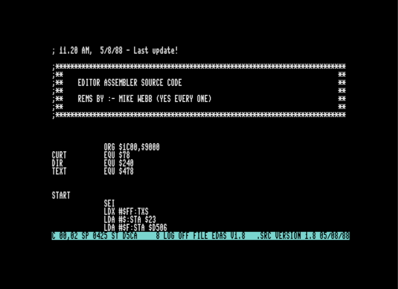

# edas v1.8 ( C128 6502 assembler )

**Version V1.8**

By Mike Webb ( circa 1988 )
Recovered, archived and documented by Kevin Edwards

This is Mike Webb's 6502 Editor/ Assembler for the C128 - a very early IDE. Software Creations used this for their early NES development. It was also used for Commodore 64/128 games and utilities. Several other development studios around the Manchester area also used it, most likely without permission! Previous to this there was a version for the Einstein computer which was also developed by Mike Webb, known as ED.COM. Later versions of the editor/assembler were made for PC. These were written by Ste Ruddy and Mike Webb. Other platforms and processors were supported by these later versions - SNES, Z80, GAMEBOY etc.

I used this during the early development of NES Magic Johnson's Fast Break.

Source files are stored in tokenised format and have the extension '.src'. ASCII characters 0x80-0xff have special meanings and are expanded into several characters for mnemonic names and assembler commands.

The editor/assembler is contained within a single tokenised source file ( edasv1.8.src ) and can only be build using itself - the .prg is included here too to do this.

I have also included a de-tokenised version of the source file ( edasv1.8.asm ) so you can browse this using your text editor of choice.

I hope it is useful to people who have an interest in 6502 assembly language programming and to those who wish to know how games were made in the 1980s.

# Build Steps

To build the code you will need to use the pre-assembled editor/assembler to assemble itself!

You will need to create an emulator disk image with 'a1.8.prg' and 'edasv1.8.src' ( such as edas.d71 ) and mount it to an emulator drive.

Run 'a1.8.prg' on a C128 / emulator with:-

 BLOAD"A1.8"
 SYS 7168

Load up the tokenised source file 'edasv1.8.src' - see instructions below.

# Additional Notes

There are no proper instructions available at this moment in time. I hope to add these in the near future.

There is basically a command mode, editor mode and debug mode.

On start-up you are in command mode:-

* Shift + Home          Enter Command Mode from editor
* $                     Perform a Directory listing
* L"edasv1.8.src"       Load source file into memory

Enter 'X' to exit command mode and go into Editor mode.

You can find me on Twitter @KevEdwardsRetro where I ramble on about all kinds of retro computer and video game things. Please drop by and say hello.

Thank you for reading this far.
